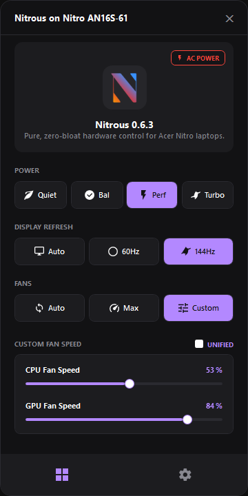
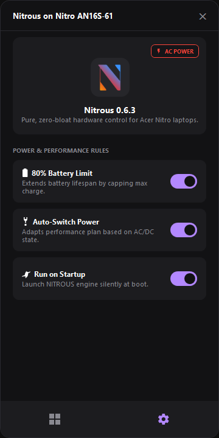

  

<h1 align="center">Nitrous</h1>

  <strong>Pure, zero-bloat hardware control for Acer Nitro laptops.</strong>

  
  &nbsp;
  

---

NitroSense is heavy. Nitrous is lightweight.

Nitrous is a single-file system utility that speaks directly to your Acer Nitro motherboard's Embedded Controller (EC) via WMI. No bloated telemetry services fighting Windows, and no unnecessary background RAM usage. Just a sleek, ultra-fast dashboard for raw, instant hardware control.

### ✨ Features

- 🎛️ **Modern Dashboard:** A beautifully designed, hardware-accelerated dark-mode UI featuring dynamic system status HUDs, crisp vector graphics, and a dedicated Active Logic automation page.
- ❄️ **Granular Fan Control:** Dial in your exact custom fan speed from 0% to 100%, or hand control safely back to the motherboard with Auto and Max modes using mathematically verified 64-bit WMI payloads.
- 🔄 **Built-in Auto-Updater:** Automatically detects and installs new releases directly from GitHub.
- 🔋 **Battery Protection:** Hardware-level 80% charge limit to preserve battery health.
- ⚡ **Dynamic Power:** Instantly swap between Quiet, Balanced, Performance, and Turbo motherboard TDP limits.
- 🧠 **Smart Auto-Switching:** Automatically drops to Quiet on battery and restores your exact previous power/fan state (e.g., Turbo) when plugged back in.
- 🖥️ **Smart Refresh Rate:** Automatically drops your laptop screen to 60Hz on battery and boosts to max Hz on AC power (safely ignores external monitors).
- 🚀 **True Startup:** Bypasses Windows UAC using Task Scheduler to launch silently in the background every time you boot.

### 📥 Installation

Because Nitrous is packaged as a standalone executable (under 1MB), there is no installer required.

1. Download **`Nitrous.exe`** from the [Releases](https://github.com/jeremyaliparo/nitrous/releases) page.
2. Place the file anywhere on your PC (e.g., your Documents or Utilities folder).
3. Double-click to run it.

### 💻 Usage

Once running, Nitrous lives quietly in your Windows System Tray. Simply **click the icon** (or press your dedicated Nitro keyboard button) to access the dashboard and hardware toggles. Click the **Settings Gear** to enable **Active Logic** automation rules and have Nitrous automatically handle your thermals, refresh rate, and battery limits forever.

### ⚙️ Compatibility

Built and tested for modern Acer Nitro laptops utilizing standard `AcerGamingFunction` WMI classes (2021+).

**Confirmed Working On:**

- Acer Nitro 16S (AN16S-61)
- Acer Nitro V 15 (ANV15-52) - _Special thanks to [@Baymax0251](https://github.com/Baymax0251) for hardware testing!_

---

_Disclaimer: This is an unofficial, open-source tool. I am not affiliated with Acer. Use at your own risk._
