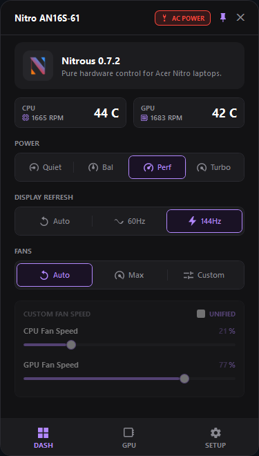
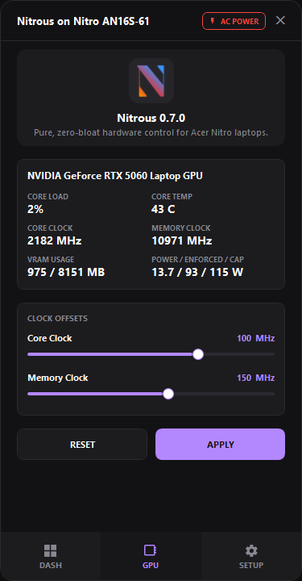
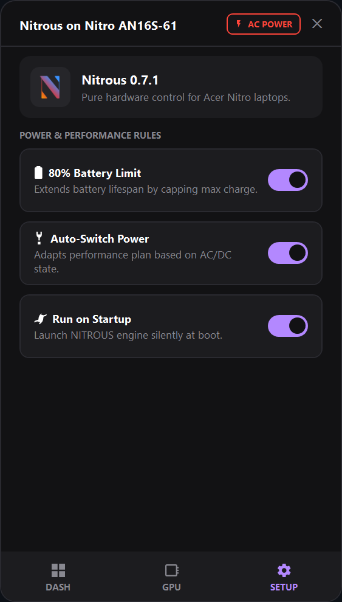

# Nitrous

**Pure, zero-bloat hardware control for Acer Nitro laptops.**

  
  
  

---

Nitrous bypasses heavy, bloated OEM telemetry services by communicating directly with your Acer Nitro’s Embedded Controller (EC) via WMI. It gives you a ultra-fast, lightweight dashboard for raw, instant hardware control.

### Key Features
* **Custom Fan Curves:** Per-profile custom fan curves with overridable pre-defined configurations, or granular manual control (0% to 100%), Auto, and Max modes via verified 64-bit WMI payloads.
* **Optimized NVML Telemetry:** Uses direct `nvml.dll` integration instead of `nvidia-smi.exe` for high-performance telemetry monitoring with low CPU overhead. Option to disable deep live telemetry on setup for older NVIDIA GPUs.
* **Dedicated GPU OC/UC Tab:** Fine-tune core and memory offsets with in-depth real-time telemetry, clock speeds, usage, and thermal tracking.
* **Auto-Apply OC Profiles:** Automatically trigger default GPU overclocks based on active power profiles (mimicking native NitroSense behavior) or automatically apply custom OC profiles on system boot.
* **CPU Power Management:** CPU Min/Max power state controls with pre-defined profile configurations.
* **Dedicated Keyboard Tab & Hotkeys:** Customizable keyboard shortcuts for cycling through power profiles and opening the Nitrous dashboard.
* **Smart Automation:** Automatically applies quiet modes and 60Hz screen refresh on battery, then restores performance and high refresh rate on AC power.
* **Battery Protection:** Hardware-level 80% charge limit to extend battery lifespan.
* **Dynamic Power Profiles:** Toggle instantly between Quiet, Balanced, Performance, and Turbo TDP modes.
* **Silent Boot & System Tray:** Bypasses Windows UAC using Task Scheduler to start silently, with quick access restart functionalities built into the system tray menu.
* **Built-in Auto-Updater:** Detects and installs updates directly from GitHub.

### Quick Start

Nitrous is a portable application (1MB) with no setup wizard needed.

1. Download **`Nitrous.exe`** from [Releases](https://github.com/jeremyaliparo/nitrous/releases).
2. Save it anywhere on your PC (e.g., `C:\Tools`).
3. Launch the executable.

> **Usage:** Nitrous runs silently in your System Tray. Click the tray icon or press your keyboard's dedicated Nitro key to open the dashboard. Configure automation rules in the **Settings** menu.

### Compatibility

Designed for modern Acer Nitro laptops (2021+) using `AcerGamingFunction` WMI classes.

**Confirmed Models:**
* Acer Nitro 16S (`AN16S-61`)
* Acer Nitro V 15 (`ANV15-41`<!--, `ANV15-52` — *Thanks [@Baymax0251](https://github.com/Baymax0251) for testing!* -->)

---

*Disclaimer: Unofficial open-source utility. Not affiliated with Acer. Use at your own risk.*
